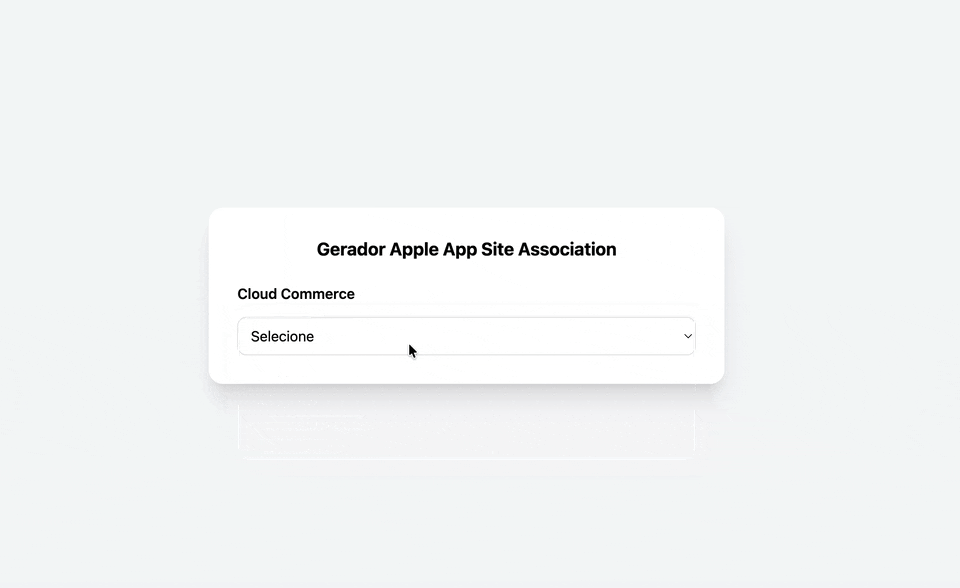

# 🚀 Gerador de Apple App Site Association (AASA)

Ferramenta web simples para gerar o arquivo **apple-app-site-association** de forma rápida e sem necessidade de acessar código.

---

## ✨ Funcionalidades

- Seleção de Cloud Commerce:
  - VTEX
  - Shopify
  - Magento
  - Salesforce
  - WakeCommerce (sem implementação no momento)

- Geração automática de paths padrão por plataforma
- Possibilidade de:
  - Usar paths padrão
  - Inserir paths customizados
  - Excluir rotas específicas
- Suporte a **App Clips**
- Download automático do JSON

---

## 🌐 Acesse o projeto

👉 ()

Exemplo:

